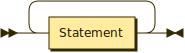
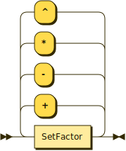
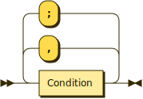
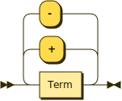

**Program:**



```
Program  ::= Statement+
```

**Statement:**


```
Statement
         ::= ( Proof | Assertion ) '.'
```

referenced by:

* Program

**Proof:**


```
Proof    ::= '?=' Inclusion
```

referenced by:

* Statement

**Assertion:**


```
Assertion
         ::= SetName ':=' SetNotation
```

referenced by:

* Statement

**SetNotation:**


```
SetNotation
         ::= Intension
           | Extention
           | SetExpression
```

referenced by:

* Assertion
* Inclusion

**Intension:**


```
Intension
         ::= '{' '|' SetElement '|' Conditions '}'
```

referenced by:

* SetNotation

**Extention:**


```
Extention
         ::= '{' ( SetElement ( ',' SetElement )* )? '}'
```

referenced by:

* SetNotation

**SetElement:**


```
SetElement
         ::= Value
           | Tuple
           | TupleElement
```

referenced by:

* Extention
* Inclusion
* Intension

**Value:**


```
Value    ::= Variable
           | '-'? Constant
           | String
```

referenced by:

* SetElement
* Tuple

**Tuple:**


```
Tuple    ::= '(' Value ( ',' Value )* ')'
```

referenced by:

* SetElement
* TupleElement

**TupleElement:**


```
TupleElement
         ::= ( Tuple | Variable ) Indexer
```

referenced by:

* Factor
* SetElement

**Indexer:**


```
Indexer  ::= '[' Expression ']'
```

referenced by:

* TupleElement

**SetExpression:**



```
SetExpression
         ::= SetFactor ( ( '+' | '-' | '*' | '^' ) SetFactor )*
```

referenced by:

* SetFactor
* SetNotation

**SetFactor:**


```
SetFactor
         ::= SetName
           | DomLimmitedSet
           | '(' SetExpression ')'
```

referenced by:

* SetExpression

**SetName:**


```
SetName  ::= [A-Z_] [a-zA-Z0-9_]*
```

referenced by:

* Assertion
* DomLimmitedSet
* SetFactor

**DomLimmitedSet:**


```
DomLimmitedSet
         ::= SetName DomLimitter
```

referenced by:

* SetFactor

**DomLimitter:**


```
DomLimitter
         ::= '<' Constant ',' Constant ',' Constant '>'
```

referenced by:

* DomLimmitedSet

**Conditions:**



```
Conditions
         ::= Condition ( ( ',' | ';' ) Condition )*
```

referenced by:

* Condition
* Intension

**Condition:**


```
Condition
         ::= Equation
           | Inequation
           | Inclusion
           | '(' Conditions ')'
```

referenced by:

* Conditions

**Inclusion:**


```
Inclusion
         ::= SetElement ( '~' | '!~' ) SetNotation
```

referenced by:

* Condition
* Proof

**Equation:**


```
Equation ::= Expression ( '=' | '!=' ) Expression
```

referenced by:

* Condition

**Inequation:**


```
Inequation
         ::= Expression ( '<' | '>' | '<=' | '>=' ) Expression
```

referenced by:

* Condition

**Expression:**



```
Expression
         ::= Term ( ( '+' | '-' ) Term )*
```

referenced by:

* Equation
* Factor
* Indexer
* Inequation

**Term:**


```
Term     ::= Factor ( ( '*' | '/' ) Factor )*
```

referenced by:

* Expression

**Factor:**


```
Factor   ::= Variable
           | Constant
           | '(' Expression ')'
           | TupleElement
```

referenced by:

* Term

**Variable:**


```
Variable ::= [a-z_] [a-zA-Z0-9_]*
```

referenced by:

* Factor
* TupleElement
* Value

**Constant:**


```
Constant ::= [0-9]* ( [0-9] | '.' [0-9]+ )
```

referenced by:

* DomLimitter
* Factor
* Value

**String:**
 

```
String   ::= '"' [a-zA-Z0-9_.:;=\!?$%&()/<>-]* '"'
```

referenced by:

* Value


<br>
<sup>generated by [RR - Railroad Diagram Generator][RR]</sup>

[RR]: https://www.bottlecaps.de/rr/ui
