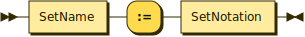
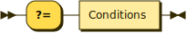
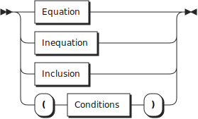
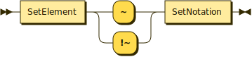
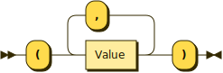
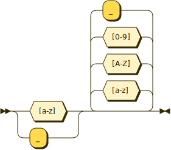

**Program:**


```
Program  ::= Statements
```

**Statements:**


```
Statements
         ::= Statements? Statement
```

referenced by:

* Program
* Statements

**Statement:**


```
Statement
         ::= ( Assertion | Proof ) '.'
```

referenced by:

* Statements

**Assertion:**



```
Assertion
         ::= SetSpecifier ':=' ( SetNotation | SetExpression )
```

referenced by:

* Statement

**Proof:**



```
Proof    ::= '?=' Conditions
```

referenced by:

* Statement

**SetNotation:**


```
SetNotation
         ::= '{' ( '|' Tuple '|' Conditions | Tuples ) '}'
           | SetSpecifier
```

referenced by:

* Assertion
* Inclusion
* Parameter

**SetExpression:**


```
SetExpression
         ::= ( SetExpression ( '+' | '-' ) )? SetTerm
```

referenced by:

* Assertion
* SetExpression
* SetFactor

**SetTerm:**


```
SetTerm  ::= ( SetTerm ( '*' | '^' ) )? SetFactor
```

referenced by:

* SetExpression
* SetTerm

**SetFactor:**


```
SetFactor
         ::= SetName
           | RangeDefinition
           | '(' SetExpression ')'
```

referenced by:

* SetTerm

**RangeDefinition:**


```
RangeDefinition
         ::= '[' Expressions ']'
```

referenced by:

* SetFactor

**Conditions:**


```
Conditions
         ::= ( Conditions ';' )? Conjunctive
```

referenced by:

* Conditions
* Proof
* Relation
* SetNotation

**Conjunctive:**


```
Conjunctive
         ::= ( Conjunctive ',' )? Relation
```

referenced by:

* Conditions
* Conjunctive

**Relation:**



```
Relation ::= Equation
           | Inequation
           | Inclusion
           | '(' Conditions ')'
```

referenced by:

* Conjunctive

**Equation:**


```
Equation ::= Expression ( '=' | '!=' ) Expression
```

referenced by:

* Relation

**Inclusion:**



```
Inclusion
         ::= Tuple ( '~' | '!~' ) SetNotation
```

referenced by:

* Relation

**SetSpecifier:**


```
SetSpecifier
         ::= SetName ( '(' Parameters ')' )?
```

referenced by:

* Assertion
* SetNotation

**Inequation:**


```
Inequation
         ::= Expression ( '<' | '>' | '<=' | '>=' ) Expression
```

referenced by:

* Relation

**Tuples:**


```
Tuples   ::= ( Tuples ',' )? Tuple
```

referenced by:

* SetNotation
* Tuples

**Tuple:**



```
Tuple    ::= Expression
           | '(' Expressions ')'
```

referenced by:

* Inclusion
* SetNotation
* Tuples

**Expressions:**


```
Expressions
         ::= ( Expressions ',' )? Expression
```

referenced by:

* Expressions
* RangeDefinition
* Tuple

**Expression:**


```
Expression
         ::= ( Expression ( '+' | '-' ) )? Term
```

referenced by:

* Equation
* Expression
* Expressions
* Factor
* Inequation
* Subscription
* Tuple

**Term:**


```
Term     ::= ( Term ( '*' | '/' ) )? Factor
```

referenced by:

* Expression
* Term

**Factor:**


```
Factor   ::= Variable
           | Subscription
           | Constant
           | '(' Expression ')'
```

referenced by:

* Term

**SetName:**


```
SetName  ::= UpperIdentifier
```

referenced by:

* Parameter
* SetFactor
* SetSpecifier

**Variable:**



```
Variable ::= LowerIdentifier
```

referenced by:

* Factor

**Parameters:**


```
Parameters
         ::= ( Parameters ',' )? Parameter
```

referenced by:

* Parameters
* SetSpecifier

**Parameter:**


```
Parameter
         ::= SetName
           | SetNotation
```

referenced by:

* Parameters

**Constant:**


```
Constant ::= [0-9]* ( [0-9] | '.' [0-9]+ )
```

referenced by:

* Factor

**Subscription:**


```
Subscription
         ::= LowerIdentifier '[' Expression ']'
```

referenced by:

* Factor

**UpperIdentifier:**


```
UpperIdentifier
         ::= [A-Z_] [a-zA-Z0-9_]*
```

referenced by:

* SetName

## 
 <sup>generated by [RR - Railroad Diagram Generator][RR]</sup>

[RR]: https://www.bottlecaps.de/rr/ui