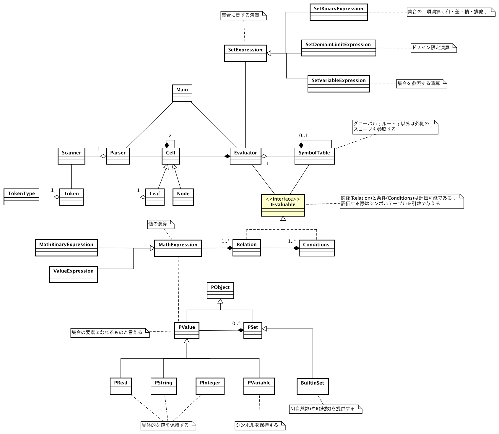

# 仮想マシン仕様書

<!-- @import "[TOC]" {cmd="toc" depthFrom=1 depthTo=6 orderedList=false} -->

<!-- code_chunk_output -->

- [仮想マシン仕様書](#仮想マシン仕様書)
  - [言語仕様にある機能のうち未実装のもの](#言語仕様にある機能のうち未実装のもの)
  - [処理系の概観](#処理系の概観)
    - [全体の処理フロー](#全体の処理フロー)
    - [フロントエンド](#フロントエンド)
    - [仮想マシンでの処理](#仮想マシンでの処理)
    - [フロントエンドと仮想マシンの協調](#フロントエンドと仮想マシンの協調)
  - [実行手順](#実行手順)
  - [仮想マシンの設計](#仮想マシンの設計)
    - [クラス図](#クラス図)
    - [集合の定義](#集合の定義)
      - [外延表記](#外延表記)
      - [内包表記](#内包表記)
      - [集合算](#集合算)
        - [ドメイン限定演算](#ドメイン限定演算)
        - [組み込み集合](#組み込み集合)
    - [評価可能オブジェクト(評価オブジェクト)](#評価可能オブジェクト評価オブジェクト)
    - [シンボルテーブル](#シンボルテーブル)
    - [エラー](#エラー)

<!-- /code_chunk_output -->

## 言語仕様にある機能のうち未実装のもの

力不足により実装が間に合わなかった機能がいくつかある．仕様書にはあるのに動かないではないか，という混乱をさけるために，あらかじめ未実装の機能をまとめておく．以下の機能については実装ができていないことをご了承願いたい．

1. タプル機能
2. 不等式演算
3. ノットイコール演算

## 処理系の概観

### 全体の処理フロー

処理系は大きく分けて二つの部分から構成される．一つはフロントエンドであり，「P~Set言語」のプログラムを入力とし，S式のような構造体をテキストで出力する．もう一方はバックエンドであり，S式ライクの構造体を入力とし，実際に処理を行う．したがって，仮想マシンあるいはバックエンドが扱うのはLispのS式とほぼ同じフォーマットの構造体のみということになる．


### フロントエンド

フロントエンドはlexとyaccを用いた翻訳機のような役割を果たしている．フロントエンドに入力する言語は，今回我々が独自に開発した集合を扱うためのプログラミング言語である．この言語に関する詳細な仕様は「言語仕様書.pdf」で取り扱っているため，そちらを参照していただきたい．

### 仮想マシンでの処理

仮想マシンの仕事は，前述の通り，S式を受け取って集合演算処理を行うことである．この言語において，主な仕事は二つある．一つは集合の定義で，もう一つは質問（あるいは証明）である．下の図は仮想マシンの内部の大まかなデータフローを表している．フロントエンドから送られてきたS式の文字列を受け取ると，S式の構文解析が行われ，Javaの構造体として扱うことができるようになる．この構造体はいわゆる二進木の形式をしている．プログラムの評価は，この二進木をトップレベルから順に辿ることで行われる．


例えば，トップレベルの二進木で，car部のトークンが「ASSERT」と一致すれば，cdr部に格納されている部分木は集合定義式であることが確定する．したがって，以降の処理を集合定義処理に委譲する．あるいは，car部のトークンが「PROVE」と一致した場合は，cdr部の評価を質問処理に委譲するいといった動作をする．

集合定義の処理では，トップレベルのシンボルテーブルに新しく集合が定義される．また，質問処理では，トップレベルのシンボルテーブルを適宜参照しながら質問に答えるといった処理を行う．

### フロントエンドと仮想マシンの協調

仮想マシンとフロントエンドのバイナリは別々のプロセスとして動作している．したがって，この二つのプロセスがどうのようにして協調動作を実現しているかを述べておかなければならない．


↓↓フロントエンドと仮想マシンの協調方式を変える可能性がある↓↓
~~結論から述べると，仮想マシンとフロントエンドは標準入出力をパイプで接続することで通信を行なっている．仮想マシンは起動すると同時に，フロントエンドを子プロセスとして起動する．このままでは子プロセスで入出力が発生しないため適切にストリームを繋ぐ必要がある．~~

## 実行手順

Makefileがあるディレクトリに移動し，`make test`を実行すればよい．これにより，フロントエンドのビルド，仮想マシンのビルド，仮想マシンの起動が行われる．ビルドが成功し，正常に仮想マシンが起動すれば`Hello, This is P~Set VM.`といったメッセージが出力されるはずである．こうなっていれば正常に起動している．

```
make test

...

Hello, This is P~Set VM.
```

以降，プログラムを入力すれば，処理系がそれに応じた処理を行ってくれる．ここに，サンプルプログラムを示しておく．言語の仕様に関する詳細な説明は言語仕様書をお読みいただきたい．

```
Nsub := N<-100,100,1>.

A := {|x| x*x - 4*x - 32 = 0, x~Nsub}.

B := {|x| x = -2*y, y~A}.

?= 0~A.

?= -4~A,8~A.

?= 0~A, 8~A.

// AとBの両方にふくまれる要素
?= x~A, x~B.

// AとBのどちらかにふくまれる要素
?= x~A; x~B.

TomLikes := {"mary", "wine"}.

BobLikes := {"mary", "beer"}.

// TomとBobの両方が好きなもの
TomAndBobLike := TomLikes * BobLikes.

// Bobは好きではないが，Tomは好きなもの
?= x!~BobLikes, x~TomLikes.
```


## 仮想マシンの設計

### クラス図

以下に示すものが仮想マシンのクラス図である．エントリポイントはMainクラスである．このクラスで標準入力の読み取り，パーサや評価器の起動などを行なっている．また，グローバル空間のシンボルテーブルもここで作成される．



注意すべきは，Expression（式）というクラスが2ヶ所に現れているという点である．MathExpressionとSetExpressionが存在するが，これらは互いに無関係である．MathExpressionは算術にまつわる式を表現するオブジェクトであり，SetExpressionは集合演算にまつわるオブジェクトである．算術演算では被演算子はPValue（値）であるのに対し，SetExpressionでの被演算子はPSet（集合）である．

### 集合の定義

集合の定義には，外延表記，内包表記，集合演算の三つの定義方法がある．フロントエンドに，次のような文を入力することで，集合定義に関するS式が得られる．

```
A_set := <集合の定義>.
```

上のプログラムは以下のようなS式に変換される．重要な点は，S式のトップレベルにおけるcar部が`ASSERT`となっていること．そして，2番目の要素が`(UPPER_ID A_set)`である．続く3番目の要素は具体的な集合の内容を示すものとなる．この節では先に述べた三つの集合定義方法について，その内容を詳細に述べていく．

```
(ASSERT (UPPER_ID A_set)
    (...
        ...
))
```

---
#### 外延表記

集合の外延表記による定義は例えば以下のようなプログラムによって行える．外延表記では，`{}`の中に集合の要素としたい値を単に並べれば良い．

```
A_set := {1, 2, 3, 4, 5}.
```

このプログラムはフロントエンドの翻訳機によって，次のようなS式に変換される．リストの3番目の要素において，そのcar部が`EXTENSION`となっている点に注目していただきたい．これが外延表記であることのキーワードである．この場合，`cdr`部には集合の要素のリストが格納されているものとみなされる．実際に`SETELEMENTS`というのが集合の要素を連ねたものとなる．

処理系は外延表記で定義された値から新たな集合を作成すると同時に，`UPPER_ID`のところで定義された集合名とともにシンボルテーブルに登録する．すでに登録されていた場合は上書きとなる．この登録によって，以降，この名前を用いて集合を参照することが可能となる．

```
(ASSERT (UPPER_ID A_set) 
    (EXTENSION 
        (SETELEMENTS 
            (SETELEMENT (INTEGER 1)) 
            (SETELEMENT (INTEGER 2)) 
            (SETELEMENT (INTEGER 3)) 
            (SETELEMENT (INTEGER 4)) 
            (SETELEMENT (INTEGER 5)))))
```

---

#### 内包表記

この処理系において一番厄介であるのが内包表記による集合定義である．集合の定義は以下のようなプログラムで行える．以下の内包表記による定義はいわゆる奇数を定義していると言えよう．

```
A_set := { |x| x = 2*y + 1, y~N<0, 10, 1>}.
```

これは，以下のようなS式に翻訳される．外延表記の集合定義では`EXTENSION`となっていた部分が，内包表記では`INTENSION`となっている．これが内包表記で集合が定義されていることの目標である．評価中にこのキーワードを見つけると，リストの以降の要素を内包表記であるとみなして処理を進める．

```
(ASSERT (UPPER_ID A_set) 
    (INTENSION 
        (SETELEMENT (LOWER_ID x)) 
        (AND 
            (= (LOWER_ID x) 
                (+ 
                    (* (INTEGER 2) (LOWER_ID y)) (INTEGER 1))) 
            (~ 
                (SETELEMENT (LOWER_ID y)) 
                (EXPRESSION 
                    (DOMLIMMITEDSET (UPPER_ID N) 
                        (DOMAINLIMITER 
                            (RANGE (INTEGER 0) (INTEGER 10)) (INTEGER 1))))))))
```

内包表記の内部は大きく二つの要素に分かれている．一つは「集合要素変数の定義」，もう一つは「条件列」である．集合要素変数というのは，上の例でいう`x`にあたる変数である．`|x|`のように縦棒で挟まれた変数と言い換えることもできる．

条件列は自由変数をふくむ複数の関係式からなる．自由変数は，包含演算子によって束縛され，束縛変数となる．基本的には，すべての変数が束縛変数になったときに関係式が評価される．関係がみたされている場合，そのときの「集合要素変数」の値が集合にふくまれる値となる．変数の束縛は，考えうるすべての組み合わせを試すため，計算量の観点からは効率が悪い．`x~N, y~N, z~N`というように包含関係を三つ書けば $ O(N^3)$ になってしまう点には注意が必要である．

---

#### 集合算

集合同士の演算によって新しい集合を生成することも可能である．集合算による集合の定義は以下のようなプログラムで行える．以下の例では集合の和演算（+）により新しい集合を生成している．演算の種類は，和（+）・差（-）・積（*）・排他的論理和（^）がある．

```
A_set := X_set + Y_set.
```

上の集合定義文は以下のようなS式に翻訳される．外延表記，内包表記のときと同様にしてみていくと，今度は`EXPRESSION`というキーワードになっている．これが集合演算であることの目標である．このキーワードの出現を確認すると，処理系は，リストの以降の部分を集合の式とみなして処理を進める．

```
(ASSERT (UPPER_ID A_set) 
    (EXPRESSION 
        (+ (UPPER_ID X_set) (UPPER_ID Y_set))))
```

##### ドメイン限定演算

集合演算にはドメイン限定演算も含まれている．この機能は主に組み込み集合に対して用いる．そもそも，この処理系では無限集合を扱うことはできない．また，集合の定義も，外延表記か内包表記，あるいは集合演算に限られるのだが，内包表記，集合演算で集合を定義する場合は，その素となる集合が必要となる．一般的に数学では自然数全体の集合や実数全体の集合を考えたりするものだが，この処理系ではそうはいかない．

そこで，自然数全体の集合が存在するものとはするけれども，それを直接扱うのではなく，「その一部を取り出す」という処理を間に挟むことによって解決している．この，部分集合を得るという操作が「ドメイン限定演算」である．そして，事実上無限集合とみなせる組み込み集合に対して，ドメイン限定演算を行うことで，自然数あるいは実数の部分集合を得ることができる．

##### 組み込み集合

処理系が提供する組み込み集合は二つある．自然数の集合と，実数の集合である．それぞれ，初期状態では名前が`N`および`R`として定義されている．これらの集合にたいして，次のような演算を行うことで「ドメイン限定」を行える．

```
N1 := N<-100, 100, 1>.
R1 := R<-1, 1, 0.1>.
```

上のプログラムは，`N1`が「-100から100まで1ずつ自然数を取り出した集合」となり，`R1`が「-1.0から1.0まで0.1ずつ実数を取り出した集合」となる．

ドメイン限定演算は以下のようなS式に翻訳される．ドメイン限定演算も「集合算」の一種であるため定義方法は`EXPRESSION`となる．続いて出現する，`DOMLIMMITEDSET`が集合演算のキーワードである．このキーワードが現れると，処理系は以降を集合に対するドメイン限定演算として処理を進める．`DOMLIMMITEDSET`以降には，「どの集合に対する演算か」という情報と「どの範囲で，いくつ刻みか」という情報が続く．

```
(ASSERT (UPPER_ID N1) 
    (EXPRESSION 
        (DOMLIMMITEDSET (UPPER_ID N) 
            (DOMAINLIMITER 
                (RANGE (INTEGER -100) (INTEGER 100)) (INTEGER 1)))))
```

### 評価可能オブジェクト(評価オブジェクト)

内包表記による集合の定義や質問処理では「評価」を行う．この際，プログラムとして入力された条件は仮想マシンの内部では「評価可能オブジェクト」に変換されている．具体的には条件(Conditions)と関係(Relation)がある．評価可能オブジェクトに対して，「集合要素名」と「シンボルーテブル」を与え，評価を行う．評価によって返される結果は`EvaluateResult`である．


`EvaluateResult`は評価に関する重要な情報を保持している．特に，肝となってくるのが以下の三つである．

1. `PSet EvaluateResult.generatedSet()`
2. `Bool EvaluateResult.satisfied()`
3. `Bool EvaluateResult.noFreeVariables()`

一つ目は「生成された集合」を返すメソッドである．というのもの，ここがこの処理系においてもっとも重要なポイントで，**評価によって集合を生成する**している．上位の評価オブジェクトは，下位の評価可能オブジェクトを評価し，そこで生成された集合に対して積演算あるいは和演算を行うことで，条件の論理積，あるいは論理和を実現している．

二つ目は「評価によって条件が満たされたか」を確かめるメソッドである．質問の結果において，yes/noの出力に関わってくる．上位の評価オブジェクトは下位の評価オブジェクトの評価結果から，自身が「条件を満たしているか」を判定する．例えば，AND条件において，下位の評価オブジェクトがどちらも条件を満たしているならば，自身も条件をみたしていると言える．また，関係(Relation)においては，例えば評価によって等式が成立した場合は「条件を満たしている」ことになる．

三つ目は「自由変数がないかどうか」である．これはすべての変数に対して束縛が成功したかどうかと言い換えることもできる．この真偽値は質問処理において，それが充足試行なのか，単なる判定なのかを区別することに役立っている．充足試行というのは，「条件列の中に自由変数が一つ存在するとき，条件を満たす値を調べる」という動作をする．対して判定では，「条件列の中の変数がすべて束縛できたとき，条件をみたす値が集合に含まれているか」を調べる．

### シンボルテーブル

処理系の至る所に気がついたら存在するのがシンボルテーブルである．このオブジェクトの役割は，名前とオブジェクトを対応づけることである．シンボルテーブルは自身が保持するテーブルへの参照と，親シンボルテーブルへの参照を保持している．

シンボルテーブルへの問い合わせがあると，まず自身のテーブル（内部的にはHashMap）を参照し，名前に対応する値が存在するかを確認する．存在した場合はその値を応答し，そうでない場合は親のテーブルに処理を委譲する．グローバルスコープのシンボルテーブルには親のシンボルテーブルが存在しないので，その場合は委譲をやめ，`null`を応答する．

シンボルテーブルには`fork`というメソッドがある．これは自身を親としたシンボルテーブルを新しく作成するものである．`fork()`は条件中の自由変数に値を束縛する際に多用している．現在のスコープのシンボルテーブルを汚さずに変数を束縛するために，シンボルテーブルをフォークし，いわばサンドボックスのような環境を作成している．そこで下位の評価オブジェクトの評価を行い，結果として得られた集合を上位の評価オブジェクトで統合するといった流れとなっている．

### エラー

正常な処理が続行できないと判断した場合，処理系はエラーを出力する．一度エラーになった場合，その後の動作は保証されない．大抵の場合は問題ないはずだが，回復処理が実装されていないtまえ保証はできない．

現在以下のようなエラーが発生しうる．どんなエラーかは名前を見ての通りである．


1. VMError
    - VMに関するエラーのすべての親クラスである
2. PSetError
    - 集合に関するエラー
3. NoSetError
    - 未定義の集合を参照しようとした際に発生する
4. NoVariableError
    - 未定義の変数を参照しようとした際に発生する