# P~Set言語仕様書


<!-- @import "[TOC]" {cmd="toc" depthFrom=1 depthTo=6 orderedList=false} -->

<!-- code_chunk_output -->

- [P~Set言語仕様書](#pset言語仕様書)
  - [言語の概観](#言語の概観)
  - [BNFによる構文の定義](#bnfによる構文の定義)
  - [マニュアル](#マニュアル)
      - [基本事項](#基本事項)
      - [条件列](#条件列)
      - [宣言文](#宣言文)
      - [証明文](#証明文)
      - [順序対](#順序対)
      - [ドメイン指定子](#ドメイン指定子)
      - [組み込み集合](#組み込み集合)
      - [鋳型](#鋳型)
      - [エラー](#エラー)

<!-- /code_chunk_output -->


## 言語の概観
&emsp;P~Setは、集合の定義とそれらについての質問で推論を駆動させるプログラミング言語である。
&emsp;P~Setのプログラムは宣言文と証明文から成る。宣言文により集合の定義と集合演算を行った上で、証明文により定義した集合についての質問を行い、演算結果を得る。
&emsp;扱える集合は有限集合のみである。一つ、あるいは複数の有限集合と、それらを用いた集合演算により新たな集合を定義していき、数値計算や論理演算を行う。
&emsp;なお、集合の元に用いることができるのは、整数、実数、文字列である。
<br>


## BNFによる構文の定義

このプログラミング言語の構文をBNFで定義したものである．BNFの方言は一般的なEBNFとほぼ同じであるはずだが，この文書では後ろに記載する「BNFの記法に関する定義」に従う．適宜参照されたし．練習.

**Program:**


```
Program  ::= Statements
```

**Statements:**

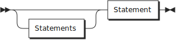

```
Statements
         ::= Statements? Statement
```

referenced by:

* Program
* Statements

**Statement:**

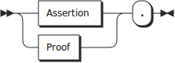

```
Statement
         ::= ( Assertion | Proof ) '.'
```

referenced by:

* Statements

**Assertion:**

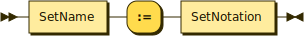

```
Assertion
         ::= SetSpecifier ':=' ( SetNotation | SetExpression )
```

referenced by:

* Statement

**Proof:**


```
Proof    ::= '?=' Conditions
```

referenced by:

* Statement

**SetNotation:**

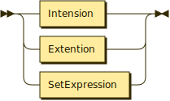

```
SetNotation
         ::= '{' ( '|' Tuple '|' Conditions | Tuples ) '}'
           | SetSpecifier
```

referenced by:

* Assertion
* Inclusion
* Parameter

**SetExpression:**

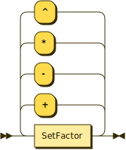

```
SetExpression
         ::= ( SetExpression ( '+' | '-' ) )? SetTerm
```

referenced by:

* Assertion
* SetExpression
* SetFactor

**SetTerm:**

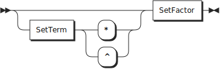

```
SetTerm  ::= ( SetTerm ( '*' | '^' ) )? SetFactor
```

referenced by:

* SetExpression
* SetTerm

**SetFactor:**

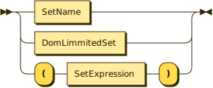

```
SetFactor
         ::= SetName
           | RangeDefinition
           | '(' SetExpression ')'
```

referenced by:

* SetTerm

**RangeDefinition:**


```
RangeDefinition
         ::= '[' Expressions ']'
```

referenced by:

* SetFactor

**Conditions:**

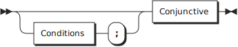

```
Conditions
         ::= ( Conditions ';' )? Conjunctive
```

referenced by:

* Conditions
* Proof
* Relation
* SetNotation

**Conjunctive:**


```
Conjunctive
         ::= ( Conjunctive ',' )? Relation
```

referenced by:

* Conditions
* Conjunctive

**Relation:**

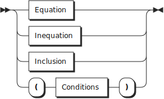

```
Relation ::= Equation
           | Inequation
           | Inclusion
           | '(' Conditions ')'
```

referenced by:

* Conjunctive

**Equation:**

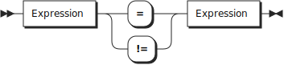

```
Equation ::= Expression ( '=' | '!=' ) Expression
```

referenced by:

* Relation

**Inclusion:**

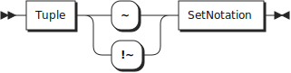

```
Inclusion
         ::= Tuple ( '~' | '!~' ) SetNotation
```

referenced by:

* Relation

**SetSpecifier:**

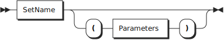

```
SetSpecifier
         ::= SetName ( '(' Parameters ')' )?
```

referenced by:

* Assertion
* SetNotation

**Inequation:**

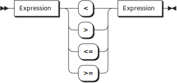

```
Inequation
         ::= Expression ( '<' | '>' | '<=' | '>=' ) Expression
```

referenced by:

* Relation

**Tuples:**

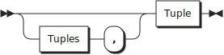

```
Tuples   ::= ( Tuples ',' )? Tuple
```

referenced by:

* SetNotation
* Tuples

**Tuple:**

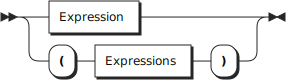

```
Tuple    ::= Expression
           | '(' Expressions ')'
```

referenced by:

* Inclusion
* SetNotation
* Tuples

**Expressions:**

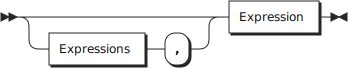

```
Expressions
         ::= ( Expressions ',' )? Expression
```

referenced by:

* Expressions
* RangeDefinition
* Tuple

**Expression:**

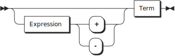

```
Expression
         ::= ( Expression ( '+' | '-' ) )? Term
```

referenced by:

* Equation
* Expression
* Expressions
* Factor
* Inequation
* Subscription
* Tuple

**Term:**

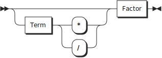

```
Term     ::= ( Term ( '*' | '/' ) )? Factor
```

referenced by:

* Expression
* Term

**Factor:**

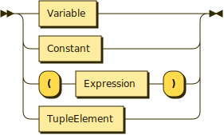

```
Factor   ::= Variable
           | Subscription
           | Constant
           | '(' Expression ')'
```

referenced by:

* Term

**SetName:**


```
SetName  ::= UpperIdentifier
```

referenced by:

* Parameter
* SetFactor
* SetSpecifier

**Variable:**


```
Variable ::= LowerIdentifier
```

referenced by:

* Factor

**Parameters:**

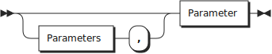

```
Parameters
         ::= ( Parameters ',' )? Parameter
```

referenced by:

* Parameters
* SetSpecifier

**Parameter:**

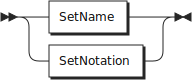

```
Parameter
         ::= SetName
           | SetNotation
```

referenced by:

* Parameters

**Constant:**

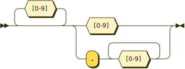

```
Constant ::= [0-9]* ( [0-9] | '.' [0-9]+ )
```

referenced by:

* Factor

**Subscription:**


```
Subscription
         ::= LowerIdentifier '[' Expression ']'
```

referenced by:

* Factor

**UpperIdentifier:**


```
UpperIdentifier
         ::= [A-Z_] [a-zA-Z0-9_]*
```

referenced by:

* SetName

**LowerIdentifier:**

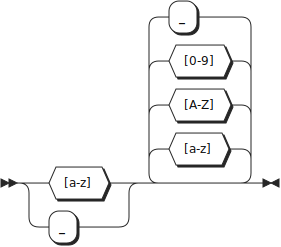

```
UpperIdentifier
         ::= [a-z_] [a-zA-Z0-9_]*
```
<br>

## マニュアル
#### 基本事項
**元**
&emsp;集合の元に用いることができるのは次の3種類のデータ型である。
  - 整数
  - 実数
  - 文字列

&emsp;また、集合を集合の元とすることはできない。すなわち、集合族は定義できない。

<br>

**プログラムの構成**
&emsp;プログラムは宣言文と証明文から成る。
&emsp;一つの宣言文、一つの証明文は、「.」で終わる。
&emsp;宣言文で集合の定義と演算を行い、証明文で定義した集合についての質問を行って、演算結果を得る。
&emsp;「/\*」と「\*/」に囲まれた範囲あるいは、1行の中の「//」で区切られた以降の文はコメントアウトされる。

```
- 例 -
       A_set := {1, 2, 3}.  // 元に「1」、「2」、「3」の三つの整数をもつ集合A_setを宣言
       ?= 1~A_set.          // 「1」が集合A_setの要素であるか、という質問
```

このプログラムを実行すると、次の実行結果が得られる。

```
>>> ?= 1~A_set.
yes
```

&emsp;任意の行数の宣言文と任意の行数の証明文、そしてそれらの順番の任意の組み合わせがプログラムに成り得る。
&emsp;ただし、ある証明文についての推論に用いられる集合とその状態は、プログラム中でその証明文より前の宣言文により定義されたものに限定される。

```
- 例 -
       A_set := {1, 2, 3}.         // 元に「1」、「2」、「3」の三つの整数をもつ集合A_setを宣言
       ?= 3~Another_set.           // 「3」が集合Another_setの要素であるか、という質問

       Another_set := {3, 4, 5}.   // 元に「3」、「4」、「5」の三つの整数をもつ集合Another_setを定義
       ?= 3~Another_set.           // 「3」が集合Another_setの要素であるか、という質問
```
このプログラムを実行すると、次の実行結果が得られる。

```
- 例 -
       >>> ?= 1~Another_set.
       NosetError: set "Another_set" is not difined before this proof.
       >>> ?= 1~Another_set.
       yes
```

&emsp;なお、宣言文の列は選言として処理される。
<br>

#### 条件列
&emsp;P~Setのプログラムを構成する宣言文と証明文の双方に深く関わる構文要素に、「条件列」がある。
&emsp;条件列は、条件式の集まりである。そして、その条件式は、算術式または帰属関係式により定義される。

**算術式**
&emsp;算術式は、等式または不等式から成る。

```
- 例 -
       x = 2*y + 1          // 等式
       2x*x - 4*x - 30 = 0  // 方程式の形式
       x != 2*y             // 等号否定
       x < 10               // 不等式
       x > 2 * y
       x <= 5
       x >= y / 3
```

&emsp;算術式中における演算子の優先順位は、C言語の算術式における演算子の優先順位と同様である。すなわち、以下の優先順位になる。上のものほど優先順位が高く、下のものほど低い。

```
*, /
+, -
<, <=
>, >=
=, !=
```

**帰属関係式**
&emsp;帰属関係式は「\~」または「!~」を用いて記述する。
&emsp;ただし、「\~」と「!~」の優先順位は同格である。

```
- 例 -
       x~X    // 元xは集合Xに帰属する
       x!~X   // 元xは集合Xに帰属しない
```

&emsp;P~Setにおいて、帰属関係式が表す命題の真否は、その関係式に現れる自由変数へ全称記号が束縛条件を与えているとみなしたときに解釈される命題の真否に一致する。
&emsp;なお、P~Setには、数理論理学において命題を構築するために用いられる存在記号と全称記号、あるいはそれらの性質に対応する記号・記法は存在しない。したがって、帰属関係式が表す命題の構築において、その関係式に現れる自由変数の束縛条件を全称記号によるものから存在記号によるものへ変更することはできない。

**条件式の連結**
&emsp;これらの条件は、ANDを表す記号「,」とORを表す記号「;」によって連結される。

```
- 例 -
       x = 3*y; x = 4*z     // xは、yを3倍した値、またはzを4倍した値である
       x = 2*y, x < 10      // xは、yを2倍した値であり、なおかつ10以下の値である
       x = 4*y, y~X         // xは、yを4倍した値であり、なおかつyはXの要素である
       x = 5*y, y!~X        // xは、yを5倍した値であり、なおかつyはXの要素ではない
```

&emsp;なお、「,」と「;」の優先順位は同格である。通常、式は左から順に評価されていく。そのため、例えば、

```
x = 2*y; x = 3*y, x = 5*y
```

という条件部があったとき、変数xに付く条件は、

```
xは、「yを2倍した値であるか、またはyを3倍した値であり」かつ「yを5倍した値である」
```

すなわち、

```
xは「yを10倍した値である」か、または「yを15倍した値である」
```

である。
&emsp;優先順位をつける場合には、これらの条件に対して、「( )」を用いた優先順位の指定を行う。

```
- 例 -
       x = 2*y; (x < 10,x > 5)     // xは、yを2倍した値であるか、または5より大きく10より小さい値である
```

よって、例えば、

```
x = 2*y; (x = 3*y, x = 5*y)
```

という条件部があったとき、変数xに付く条件は、

```
xは「yを2倍した値である」か、または「yを3倍した値であり、かつyを5倍した値である」
```

すなわち、

```
xは「yを2倍した値である」か、または「yを15倍した値である」
```

である。
<br>

#### 宣言文
**一般事項**
&emsp;宣言文で集合の定義を行う。
&emsp;集合の宣言には、次の構文を用いる。

```
「集合名」 := 「集合表記」
```

&emsp;「集合名」には、英字、数字、「_」（アンダーバー）から成る列を用いる。ただし、その先頭は大文字のアルファベットでなければならない。
&emsp;また、組み込み集合の名前と同じ名前は利用できない。

```
- 例 -
       Set := {1, 2, 3}     // このような集合名は許される
       set := {1, 2, 3}     // このような集合名は許されない
```

&emsp;「集合表記」部分には、集合の元を定義する文を記述する。
&emsp;集合の定義の方法には、外延表記による定義、内包表記による定義、集合演算式による定義の3種類がある。

**外延表記による定義**
&emsp;集合を、その元を列挙することで定義する。
&emsp;ただし、文字列に利用できるのは、英字と数字、「_」（アンダーバー）のみである。そして、文字列は「"」（ダブルクォーテーション）で囲まなければならない。
&emsp;異なるデータ型を一つの集合の元とすることもできる。

```
- 例 -
       A_set := {-3, 4, 11}               // 整数
       B_set := {0.1, 1.543, 10.445}      // 実数
       C_set := {"aaa", "B_B", "ccc0"}    // 文字列
       D_set := {3, "5.30", "0a"}         // 整数、実数、文字列が混在する集合
```

&emsp;空集合は次のように定義する。

```
Phi_set := {}        // 空集合
```

&emsp;なお、外延表記で用いる「,」は要素と別の要素を区別するための記号でしかなく、内包表記における「,」が持つような「AND」の意味は持たない。
&emsp;また、集合族は定義できない。

**内包表記による定義**
&emsp;集合を、その元が従う規則を定めることで定義する。
&emsp;内包表記による集合の表記には、次の構文を用いる。

```
{|「変数」| 「条件列」}
```

&emsp;変数部で、集合の元を表す変数を指定する。
&emsp;条件部には、条件列を記述する。この条件部により、変数部の変数が従う規則が定まる。

```
A_set := {|x| x = 2*y, y~X}.              // 集合Xの要素を2倍した値を元とする集合
B_set := {|x| x = 3*y, y~{1, 2, 3}}       // 条件式に外延表記の集合を用いることもできる。
```
<br>

**集合演算式による定義**
&emsp;集合を、集合演算の結果を用いて定義する。
&emsp;次の構文を用いる。

```
「集合名」 := 「集合名」 (「集合演算子」 「集合名」)?
```

&emsp;使用できる集合演算子とその機能は、次のとおりである。

```
+      // 和
*      // 積
-      // 差
^      // 排他的論理和
```

&emsp;演算子の優先順位は同格である。式は左から順に評価される。
&emsp;同時に、「( )」を用いて演算の優先順位を指定することもできる。

```
- 例 -
       A := B + C.
       A := B * C.
       A := B - C.
       A := B ^ C.
       A := ((B + C) * (D - E)) ^ F.
```
<br>

#### 証明文
**一般事項**
&emsp;証明文により、演算を駆動させる。
&emsp;証明文には、次の構文を用いる。

```
?= 「条件列」
```

&emsp;条件列により、演算の内容を指定する。そして、その演算結果を得る。
&emsp;証明には、条件列の真否判定と、条件充足試行の二種類がある。

**条件列の真否判定**
&emsp;与えられた条件列の示す命題が成立するかどうかを判定する。

```
- 例 -
       --- プログラム ---
       ?= (2 = 2*y), y~{1}.               // 等式の判定
       ?= 1 != 1.
       ?= (2<3*y), y~{1, 2}.              // 不等式の判定

       Tom_likes := {"wine", "mary"}.     // 集合Tom_likesを定義
       ?= "wine"~Tom_likes.               // 集合Tom_likesに値"wine"が含まれるかどうかを判定
       ?= "whisky"~Tom_likes.


       --- 実行結果 ---
       >>> ?= (2 = 2*y), y~{1}.
       yes.
       >>> ?= (2<3*y), y~{1, 2}.
       yes.
       >>> ?= 1 != 1.
       no.
       >>> ?= "wine"~Tom_likes.
       yes.
       >>> ?= "whisky"~Tom_likes.
       no.
```

**条件充足試行**
&emsp;条件列の中に未定義の変数をただ一つ用いることで、その条件列を充足する変数の値の特定を試みる。充足する値が見つかった場合、それを列挙する。

```
- 例 -
       --- プログラム ---
       ?= (x = 2*y), y~{1, 2, 3}.         // 変数xが未定義

       Tom_likes := {"wine", "mary"}.
       ?= x~Tom_likes.                    // 集合Tom_likesの要素は何か？

       John_likes := {"wine", "whisky"}.
       Adam_likes := {"mary", "whisky"}.
       ?= "wine"~X.                       // "wine"を元に持つ集合は何か？


       --- 実行結果 ---
       >>> ?= (x = 2*y), y~{1, 2, 3}.
       2, 4, 6
       >>> ?= x~Tom_likes.
       "wine", "mary"
       >>> ?= "wine"~X.
       Tom_likes, John_likes
```
<br>

#### 順序対
**基本事項**
&emsp;順序対を集合の要素にすることができる。
&emsp;外延表記と内包表記のどちらにも対応している。

```
- 例 -
       A_set := {(1, 2), (3, 4), (4, 5)}.
       B_set := {| (x, y) | x = 5*y, y~{1, 2}}.         // {(5, 1), (10, 2)}に等しい
       C_set := {("a", "b", "c"), ("d", "e", "f")}.     // 3つ以上の要素を持つ順序対も利用可能
```

&emsp;タプルを元として持つ集合においても、値を元として持つ集合と同様に集合演算を行える。ただし、同じ要素を持つ順序対内同士でも、要素の順番が異なれば異なる元になる。


```
- 例 -
       --- プログラム ---
       A_set := {(1, 2)}.
       B_set := {(2, 1)}.          // A_setの元である順序対と、その要素は同じだが順番は異なる順序対を元とする集合
       C_set := A_set * B_set.
       ?= x~C_set.


       --- 実行結果 ---
       >>> ?= x~C_set.
       {}                          // 空集合
```

**サブスクリプション**
&emsp;他のプログラミング言語でいう配列やリストのように、タプルの要素をインデックスにより取り出す機能。
&emsp;タプルの要素を左から順に昇順のインデックスで指定する。
&emsp;0オリジン。

```
- 例 -
       --- プログラム ---
       A_set := {(1, 2), (3, 4), (5, 6)}.
       B_set := {|x| x = z[0], z~A_set}.  // A_setの元はタプル。その第1要素からなる集合
       ?=  x~B_set.

       --- 実行結果 ---
       >>> ?=  x~B_set.
       1, 3, 5
```

&emsp;サブスクリプションは、通常の変数と同様に扱える。

```
- 例 -
       --- プログラム ---
       A_set := {(1, 2), (3, 4), (5, 6)}.
       B_set := {|x| x = z[0] + z[1], z~A_set}.
       ?=  x~B_set.

       --- 実行結果 ---
       >>> ?=  x~B_set.
       3, 7, 11
```
<br>

#### ドメイン指定子
&emsp;集合の定義後に、集合の元のドメインを後付けで規定する演算子。
&emsp;範囲の下限、上限、刻み幅の3数を指定する。
&emsp;対象とする集合の元の内、ドメイン指定子が指定するドメインに含まれるものを集めた集合を定義する。
&emsp;上限、下限の値はドメインに含まれる。
&emsp;ドメイン指定子に用いられる値は、整数と実数である。
&emsp;次の記法を用いる。

```
<「下限」, 「上限」, 「刻み幅」>
```

&emsp;次のように用いる。

```
- 例 -
       --- プログラム ---
       A_set := {1, 2, 3, 4, 5, 6, 7, 8, 9, 10}.
       B_set := A_set<2, 6, 2>
       ?= x~B_set.

       C_set := {0.1, 0.2, 0.3, 0.4, 0.5, 0.6, 0.7, 0.8}.
       D_set := C_set<0.25, 0.75, 0.15>
       ?= x~D_set.

       E_set := {1, 2, 3, 4, 5, 6, 7, 8, 9, 10}.
       F_set := A_set<2, 15, 2>
       ?= x~F_set.

       --- 実行結果 ---
       >>> ?= x~B_set.
       2, 4, 6
       >>> ?= x~D_set.
       0.4, 0.7
       >>> ?= x~F_set.
       2, 4, 6
```

&emsp;ドメイン指定子を対象とする集合に作用させても、その集合に変化はない。新たな集合が定義されるのみである。
&emsp;対象とする集合の値の範囲がドメイン指定子の定めるドメインの最大値より大きい、あるいは最小値より小さい場合には、ドメインの最大値・最小値は、対象とする集合の最大値・最小値に限定される。

```
- 例 -
       --- プログラム ---
       A_set := {1, 2, 3, 4, 5, 6, 7, 8, 9, 10}.
       B_set := A_set<2, 15, 2>                  // ドメイン指定子が<2, 10, 2>でも同じ結果
       ?= x~B_set.

       --- 実行結果 ---
       >>> ?= x~B_set.
       2, 4, 6
```
<br>

#### 組み込み集合
&emsp;処理系が用意する、仮想的な無限集合。
&emsp;必ず、ドメイン指定子とともに用いる。
&emsp;次の2種類がある。

```
Z      // 整数全体の集合
R      // 実数全体の集合
```

&emsp;次のように用いる。

```
- 例 -
       --- プログラム ---
       A_set := {|x| x~Z<1, 5, 1>}
       ?= x~A_set.

       B_set := {|x| x = 2*y, y~Z<-3, 3, 1>}.
       ?= x~B_set.

       C_set := {|x| x~R<0, 1, 0.1>}.
       ?= x~C_set.

       --- 実行結果 ---
       >>> ?= x~A_set.
       1, 2, 3, 4, 5
       >>> ?= x~B_set.
       -6, -4, -2, 0, 2, 4, 6
       >>> ?= x~C_set.
       0.1, 0.2, 0.3, 0.4, 0.5, 0.6, 0.7, 0.8, 0.9, 0.10
```
<br>

#### 鋳型
__*! 見合わせ中 !*__
<br>

#### エラー
__*! 思案中 !*__
* NosetError: set "Another_set" is not difined before this proof.
* 文字列の集合をもとの集合として、算術式が条件に来ている集合を定義しようとすると出るエラー
* 組み込み集合の名前と同じ名前を用いようとしたときのエラー

* 構文解析時にわかるもの
* 集合名の先頭が大文字でない。
