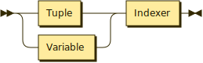
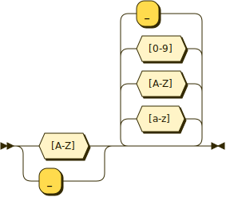
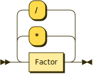

# P\~Set言語仕様書


<!-- @import "[TOC]" {cmd="toc" depthFrom=1 depthTo=6 orderedList=false} -->

<!-- code_chunk_output -->

- [P\~Set言語仕様書](#pset言語仕様書)
  - [言語の概観](#言語の概観)
  - [補足事項](#補足事項)
  - [BNFによる構文の定義](#bnfによる構文の定義)
  - [マニュアル](#マニュアル)
      - [基本事項](#基本事項)
      - [条件列](#条件列)
      - [宣言文](#宣言文)
      - [証明文](#証明文)
      - [順序対](#順序対)
      - [ドメイン限定子](#ドメイン限定子)
      - [組み込み集合](#組み込み集合)
      - [鋳型](#鋳型)
      - [エラー](#エラー)

<!-- /code_chunk_output -->


## 言語の概観
&emsp;P\~Setは、集合の定義とそれらについての質問で推論を駆動させるプログラミング言語である。
&emsp;P\~Setは、「Programing in Set」の略称である。日本語で「ピンセット」と発音する。「~」は、ある元がある集合に含まれる（element in a set）ことをこの言語において表す記号であり、「in」の意味を持つ。
&emsp;P\~Setのプログラムは宣言文と証明文から成る。宣言文により集合の定義と集合演算を行った上で、証明文により定義した集合についての質問を行い、演算結果を得る。
&emsp;扱える集合は有限集合のみである。一つ、あるいは複数の有限集合と、それらを用いた集合演算により新たな集合を定義していき、数値計算や論理演算を行う。
&emsp;なお、集合の元に用いることができるのは、整数、実数、文字列である。
<br>
<br>
<br>


## 補足事項
&emsp;このP~Set言語仕様書には記載しているが、実装はしていない機能を、次に示す。

```
・ 不等式
・ 順序対
・ 鋳型
```

<br>
<br>
<br>


## BNFによる構文の定義

このプログラミング言語の構文をBNFで定義したものは以下のようになる。

**Program:**


```
Program  ::= Statement+
```

**Statement:**


```
Statement
         ::= ( Proof | Assertion ) '.'
```

referenced by:

* Program

**Proof:**


```
Proof    ::= '?=' Conditions
```

referenced by:

* Statement

**Assertion:**


```
Assertion
         ::= SetName ':=' SetNotation
```

referenced by:

* Statement

**SetNotation:**


```
SetNotation
         ::= Intension
           | Extention
           | SetExpression
```

referenced by:

* Assertion
* Inclusion

**Intension:**


```
Intension
         ::= '{' '|' SetElement '|' Conditions '}'
```

referenced by:

* SetNotation

**Extention:**


```
Extention
         ::= '{' ( SetElement ( ',' SetElement )* )? '}'
```

referenced by:

* SetNotation

**SetElement:**


```
SetElement
         ::= Value
           | Tuple
           | TupleElement
```

referenced by:

* Extention
* Inclusion
* Intension

**Value:**


```
Value    ::= Variable
           | '-'? Constant
           | String
```

referenced by:

* SetElement
* Tuple

**Tuple:**


```
Tuple    ::= '(' Value ( ',' Value )* ')'
```

referenced by:

* SetElement
* TupleElement

**TupleElement:**



```
TupleElement
         ::= ( Tuple | Variable ) Indexer
```

referenced by:

* Factor
* SetElement

**Indexer:**


```
Indexer  ::= '[' Expression ']'
```

referenced by:

* TupleElement

**SetExpression:**


```
SetExpression
         ::= SetFactor ( ( '+' | '-' | '*' | '^' ) SetFactor )*
```

referenced by:

* SetFactor
* SetNotation

**SetFactor:**


```
SetFactor
         ::= SetName
           | DomLimmitedSet
           | '(' SetExpression ')'
```

referenced by:

* SetExpression

**SetName:**



```
SetName  ::= [A-Z_] [a-zA-Z0-9_]*
```

referenced by:

* Assertion
* DomLimmitedSet
* SetFactor

**DomLimmitedSet:**


```
DomLimmitedSet
         ::= SetName DomLimitter
```

referenced by:

* SetFactor

**DomLimitter:**


```
DomLimitter
         ::= '<' Constant ',' Constant ',' Constant '>'
```

referenced by:

* DomLimmitedSet

**Conditions:**


```
Conditions
         ::= Condition ( ( ',' | ';' ) Condition )*
```

referenced by:

* Condition
* Intension
* Proof

**Condition:**


```
Condition
         ::= Equation
           | Inequation
           | Inclusion
           | '(' Conditions ')'
```

referenced by:

* Conditions

**Inclusion:**


```
Inclusion
         ::= SetElement ( '~' | '!~' ) SetNotation
```

referenced by:

* Condition

**Equation:**


```
Equation ::= Expression ( '=' | '!=' ) Expression
```

referenced by:

* Condition

**Inequation:**


```
Inequation
         ::= Expression ( '<' | '>' | '<=' | '>=' ) Expression
```

referenced by:

* Condition

**Expression:**


```
Expression
         ::= Term ( ( '+' | '-' ) Term )*
```

referenced by:

* Equation
* Factor
* Indexer
* Inequation

**Term:**



```
Term     ::= Factor ( ( '*' | '/' ) Factor )*
```

referenced by:

* Expression

**Factor:**


```
Factor   ::= Variable
           | Constant
           | '(' Expression ')'
           | TupleElement
```

referenced by:

* Term

**Variable:**


```
Variable ::= [a-z_] [a-zA-Z0-9_]*
```

referenced by:

* Factor
* TupleElement
* Value

**Constant:**


```
Constant ::= [0-9]* ( [0-9] | '.' [0-9]+ )
```

referenced by:

* DomLimitter
* Factor
* Value

**String:**
 

```
String   ::= '"' [a-zA-Z0-9_ \t.:;=\!?$%&()/<>-]* '"'
```

referenced by:

* Value


<br>
<sup>generated by [RR - Railroad Diagram Generator][RR]</sup>

[RR]: https://www.bottlecaps.de/rr/ui

<br>
<br>
<br>


## マニュアル
#### 基本事項
**値**
&emsp;値として利用できるデータ型は、次の3種類である。
  - 整数
  - 実数
  - 文字列

<br>

**集合要素**
&emsp;集合の要素にできるのは、次の二つである。
 - 値
 - 順序対

&emsp;集合を集合の元とすることはできない。すなわち、集合族は定義できない。
<br>

**プログラムの構成**
&emsp;プログラムは宣言文と証明文から成る。
&emsp;一つの宣言文、一つの証明文は、「.」で終わる。
&emsp;宣言文で集合の定義と演算を行い、証明文で定義した集合についての質問を行って、演算結果を得る。
&emsp;「/\*」と「\*/」に囲まれた範囲あるいコメントアウトされる。

```
- 例 -
       A_set := {1, 2, 3}.  // 元に「1」、「2」、「3」の三つの整数をもつ集合A_setを宣言
       ?= 1~A_set.          // 「1」が集合A_setの要素であるか、という質問
```

このプログラムを実行すると、次の実行結果が得られる。

```
>>> ?= 1~A_set.
yes
```

&emsp;任意の行数の宣言文と任意の行数の証明文、そしてそれらの順番の任意の組み合わせがプログラムに成り得る。
&emsp;ただし、ある証明文についての推論に用いられる集合とその状態は、プログラム中でその証明文より前の宣言文により定義されたものに限定される。

```
- 例 -
       --- プログラム ---
       A_set := {1, 2, 3}.         // 元に「1」、「2」、「3」の三つの整数をもつ集合A_setを宣言
       ?= 3~Another_set.           // 「3」が集合Another_setの要素であるか、という質問

       Another_set := {3, 4, 5}.   // 元に「3」、「4」、「5」の三つの整数をもつ集合Another_setを定義
       ?= 3~Another_set.           // 「3」が集合Another_setの要素であるか、という質問


       --- 実行結果 ---
       >>> ?= 1~Another_set.
              >>> NosetError: set "Another_set" is not difined before this proof.
       >>> ?= 1~Another_set.
              >>> yes.
```

&emsp;なお、宣言文の列は選言として処理される。
<br>
<br>


#### 条件列
&emsp;P\~Setのプログラムを構成する宣言文に深く関わる構文要素に、「条件列」がある。
&emsp;条件列は、条件式の集まりである。そして、その条件式は、算術式または帰属関係式により定義される。

**算術式**
&emsp;算術式は、等式または不等式から成る。

```
- 例 -
       x = 2*y + 1          // 等式
       2x*x - 4*x - 30 = 0  // 方程式の形式
       x != 2*y             // 等号否定
       x < 10               // 不等式
       x > 2 * y
       x <= 5
       x >= y / 3
```

&emsp;算術式中における演算子の優先順位は、C言語の算術式における演算子の優先順位と同様である。すなわち、以下の優先順位になる。上のものほど優先順位が高く、下のものほど低い。

```
*, /
+, -
<, <=
>, >=
=, !=
```
<br>

**帰属関係式**
&emsp;帰属関係は「\~」または「!\~」を用いて記述する。帰属関係がある場合に「\~」、ない場合に「!\~」を用いる。
&emsp;式の左辺に集合要素、右辺に集合という形の式のみが許される。
&emsp;ただし、「\~」と「!\~」の優先順位は同格である。

```
- 例 -
       x~X    // 元xは集合Xに帰属する
       x!~X   // 元xは集合Xに帰属しない
```

&emsp;P\~Setにおいて、帰属関係式が表す命題の真否は、その関係式に現れる自由変数へ全称記号が束縛条件を与えているとみなしたときに解釈される命題の真否に一致する。
&emsp;なお、P\~Setには、数理論理学において命題を構築するために用いられる存在記号と全称記号、あるいはそれらの性質に対応する記号・記法は存在しない。したがって、帰属関係式が表す命題の構築において、その関係式に現れる自由変数の束縛条件を全称記号によるものから存在記号によるものへ変更することはできない。
<br>

**条件式の連結**
&emsp;これらの条件は、ANDを表す記号「,」とORを表す記号「;」によって連結される。

```
- 例 -
       x = 3*y; x = 4*z     // xは、yを3倍した値、またはzを4倍した値である
       x = 2*y, x < 10      // xは、yを2倍した値であり、なおかつ10以下の値である
       x = 4*y, y~X         // xは、yを4倍した値であり、なおかつyはXの要素である
       x = 5*y, y!~X        // xは、yを5倍した値であり、なおかつyはXの要素ではない
```

&emsp;なお、「,」と「;」の優先順位は同格である。通常、式は左から順に評価されていく。そのため、例えば、

```
x = 2*y; x = 3*y, x = 5*y
```

という条件部があったとき、変数xに付く条件は、

```
xは、「yを2倍した値であるか、またはyを3倍した値であり」かつ「yを5倍した値である」
```

すなわち、

```
xは「yを10倍した値である」か、または「yを15倍した値である」
```

である。
&emsp;優先順位をつける場合には、これらの条件に対して、「( )」を用いた優先順位の指定を行う。

```
- 例 -
       x = 2*y; (x < 10,x > 5)     // xは、yを2倍した値であるか、または5より大きく10より小さい値である
```

よって、例えば、

```
x = 2*y; (x = 3*y, x = 5*y)
```

という条件部があったとき、変数xに付く条件は、

```
xは「yを2倍した値である」か、または「yを3倍した値であり、かつyを5倍した値である」
```

すなわち、

```
xは「yを2倍した値である」か、または「yを15倍した値である」
```

である。
<br>
<br>


#### 宣言文
**一般事項**
&emsp;宣言文で集合の定義を行う。
&emsp;集合の宣言には、次の構文を用いる。

```
「集合名」 := 「集合表記」
```

&emsp;「集合名」には、英字、数字、「_」（アンダーバー）から成る列を用いる。ただし、その先頭は大文字のアルファベットでなければならない。
&emsp;また、組み込み集合の名前と同じ名前は利用できない。

```
- 例 -
       Set := {1, 2, 3}.    // このような集合名は許される
       set := {1, 2, 3}.    // このような集合名は許されない
```

&emsp;「集合表記」部分には、集合の元を定義する文を記述する。
&emsp;集合の定義の方法には、外延表記による定義、内包表記による定義、集合演算式による定義の3種類がある。
<br>

**外延表記による定義**
&emsp;集合を、その元を列挙することで定義する。
&emsp;ただし、文字列に利用できるのは、英字と数字、以下に示す記号、そして半角スペースである。そして、文字列は「"」（ダブルクォーテーション）で囲まなければならない。

```
.
:
;
=
\
!
#
$
%
&
\
(
\
)
/
<
>
\
?
-
```


&emsp;異なるデータ型を一つの集合の元とすることもできる。

```
- 例 -
       A_set := {-3, 4, 11}.              // 整数
       B_set := {0.1, 1.543, 10.445}.     // 実数
       C_set := {"aaa", "B_B", "ccc0"}.   // 文字列
       D_set := {3, "5.30", "0a"}.        // 整数、実数、文字列が混在する集合
```

&emsp;空集合は次のように定義する。

```
Phi_set := {}.       // 空集合
```

&emsp;なお、外延表記で用いる「,」は要素と別の要素を区別するための記号でしかなく、内包表記における「,」が持つような「AND」の意味は持たない。
&emsp;また、集合族は定義できない。
<br>

**内包表記による定義**
&emsp;集合を、その元が従う規則を定めることで定義する。
&emsp;内包表記による集合の表記には、次の構文を用いる。

```
{|「変数」| 「条件列」}
```

&emsp;変数部で、集合の元を表す変数を指定する。
&emsp;条件部には、条件列を記述する。この条件部により、変数部の変数が従う規則が定まる。

```
A_set := {|x| x = 2*y, y~X}.              // 集合Xの要素を2倍した値を元とする集合
B_set := {|x| x = 3*y, y~{1, 2, 3}}.      // 条件式に外延表記の集合を用いることもできる。
```
<br>

**集合演算式による定義**
&emsp;集合を、集合演算の結果を用いて定義する。
&emsp;次の構文を用いる。

```
「集合名」 := 「集合名」 (「集合演算子」 「集合名」)?
```

&emsp;使用できる集合演算子とその機能は、次のとおりである。

```
+      // 和
*      // 積
-      // 差
^      // 排他的論理和
```

&emsp;演算子の優先順位は同格である。式は左から順に評価される。
&emsp;同時に、「( )」を用いて演算の優先順位を指定することもできる。

```
- 例 -
       A := B + C.
       A := B * C.
       A := B - C.
       A := B ^ C.
       A := ((B + C) * (D - E)) ^ F.
```
<br>
<br>


#### 証明文
**一般事項**
&emsp;証明文により、演算を駆動させる。
&emsp;証明文には、次の構文を用いる。

```
?= 「条件列」
```

&emsp;条件列により、演算の内容を指定する。そして、その演算結果を得る。
&emsp;ただし、ある証明文についての推論に用いられる集合とその状態は、プログラム中でその証明文より前の宣言文により定義されたものに限定される。
&emsp;証明には、条件列の真否判定と、帰属関係式の充足試行の二種類がある。
<br>

**条件列の真否判定**
&emsp;与えられた条件列の示す命題が成立するかどうかを判定する。

```
- 例 -
       --- プログラム ---
       ?= (2 = 2*y), y~{1}.               // 等式の判定
       ?= 1 != 1.
       ?= (2<3*y), y~{1, 2}.              // 不等式の判定

       Tom_likes := {"wine", "mary"}.     // 集合Tom_likesを定義
       ?= "wine"~Tom_likes.               // 集合Tom_likesに値"wine"が含まれるかどうかを判定
       ?= "whisky"~Tom_likes.


       --- 実行結果 ---
       >>> ?= (2 = 2*y), y~{1}.
       yes.
       >>> ?= (2<3*y), y~{1, 2}.
       yes.
       >>> ?= 1 != 1.
       no.
       >>> ?= "wine"~Tom_likes.
       yes.
       >>> ?= "whisky"~Tom_likes.
       no.
```
<br>

**帰属関係式の充足試行**
&emsp;帰属関係式の中に未定義の変数をただ一つ用いることで、その帰属関係を充足する集合要素、または集合の特定を試みる。
&emsp;充足する集合要素、または集合がある場合には、それらが列挙される。
&emsp;充足する集合要素、または集合がない場合には、「>>> none.」と表示される。
&emsp;帰属関係式の中に未定義の変数が2つある場合には、エラーとなる。

```
- 例 -
       --- プログラム ---
       Tom_likes := {"wine", "mary"}.
       ?= x~Tom_likes.                    // 集合Tom_likesの要素は何か？

       John_likes := {"wine", "whisky"}.
       ?= "wine"~X.                       // "wine"を元に持つ集合は何か？

       ?= "beer".                         // "beer"を元に持つ集合は何か？


       --- 実行結果 ---
       >>> ?= x~Tom_likes.
              "wine", "mary"
       >>> ?= "wine"~X.
              Tom_likes, John_likes
       >>> ?= "beer".
              >>> none.
```
<br>
<br>


#### 順序対
**基本事項**
&emsp;順序対を集合の要素にすることができる。
&emsp;順序対の要素のできるのは、値、または1文字の変数である。
&emsp;外延表記と内包表記のどちらにも対応している。

```
- 例 -
       A_set := {(1, 2), (3, 4), (4, 5)}.
       B_set := {| (x, y) | x = 5*y, y~{1, 2}}.         // {(5, 1), (10, 2)}に等しい
       C_set := {("a", "b", "c"), ("d", "e", "f")}.     // 3つ以上の要素を持つ順序対も利用可能
```

&emsp;タプルを元として持つ集合においても、値を元として持つ集合と同様に集合演算を行える。ただし、同じ要素を持つ順序対内同士でも、要素の順番が異なれば異なる集合要素になる。


```
- 例 -
       --- プログラム ---
       A_set := {(1, 2)}.
       B_set := {(2, 1)}.          // A_setの元である順序対と、その要素は同じだが順番は異なる順序対を元とする集合
       C_set := A_set * B_set.
       ?= x~C_set.


       --- 実行結果 ---
       >>> ?= x~C_set.
       {}                          // 空集合
```
<br>

**インデクサ**
&emsp;他のプログラミング言語でいう配列やリストのように、タプルの要素をインデックスにより取り出す機能。
&emsp;タプルの要素を左から順に昇順のインデックスで指定する。
&emsp;0オリジン。

```
- 例 -
       --- プログラム ---
       A_set := {(1, 2), (3, 4), (5, 6)}.
       B_set := {|x| x = z[0], z~A_set}.  // A_setの元はタプル。その第1要素からなる集合
       ?=  x~B_set.

       --- 実行結果 ---
       >>> ?=  x~B_set.
              1, 3, 5
```

&emsp;インデクサは、通常の変数と同様に扱える。

```
- 例 -
       --- プログラム ---
       A_set := {(1, 2), (3, 4), (5, 6)}.
       B_set := {|x| x = z[0] + z[1], z~A_set}.
       ?=  x~B_set.

       --- 実行結果 ---
       >>> ?=  x~B_set.
              3, 7, 11
```
<br>
<br>


#### ドメイン限定子
&emsp;集合の定義後に、集合の元のドメインを後付けで規定する演算子。
&emsp;範囲の下限、上限、刻み幅の3数を指定する。
&emsp;対象とする集合の元の内、ドメイン限定子が指定するドメインに含まれるものを集めた集合を定義する。
&emsp;上限、下限の値はドメインに含まれる。
&emsp;ドメイン限定子に用いられる値は、整数と実数である。
&emsp;次の記法を用いる。

```
<「下限」, 「上限」, 「刻み幅」>
```

&emsp;次のように用いる。

```
- 例 -
       --- プログラム ---
       A_set := {1, 2, 3, 4, 5, 6, 7, 8, 9, 10}.
       B_set := A_set<2, 6, 2>
       ?= x~B_set.

       C_set := {0.1, 0.2, 0.3, 0.4, 0.5, 0.6, 0.7, 0.8}.
       D_set := C_set<0.25, 0.75, 0.15>
       ?= x~D_set.

       E_set := {1, 2, 3, 4, 5, 6, 7, 8, 9, 10}.
       F_set := A_set<2, 15, 2>
       ?= x~F_set.

       --- 実行結果 ---
       >>> ?= x~B_set.
              2, 4, 6
       >>> ?= x~D_set.
              0.4, 0.7
       >>> ?= x~F_set.
              2, 4, 6
```

&emsp;ドメイン限定子を対象とする集合に作用させても、その集合に変化はない。新たな集合が定義されるのみである。
&emsp;対象とする集合の値の範囲がドメイン限定子の定めるドメインの最大値より大きい、あるいは最小値より小さい場合には、ドメインの最大値・最小値は、対象とする集合の最大値・最小値に限定される。

```
- 例 -
       --- プログラム ---
       A_set := {1, 2, 3, 4, 5, 6, 7, 8, 9, 10}.
       B_set := A_set<2, 15, 2>                  // ドメイン限定子が<2, 10, 2>でも同じ結果
       ?= x~B_set.

       --- 実行結果 ---
       >>> ?= x~B_set.
              2, 4, 6
```
<br>
<br>


#### 組み込み集合
&emsp;処理系が用意する、仮想的な無限集合。
&emsp;必ず、ドメインとともに用いる。
&emsp;次の2種類がある。

```
Z      // 整数全体の集合
R      // 実数全体の集合
```

&emsp;次のように用いる。

```
- 例 -
       --- プログラム ---
       A_set := {|x| x~Z<1, 5, 1>}
       ?= x~A_set.

       B_set := {|x| x = 2*y, y~Z<-3, 3, 1>}.
       ?= x~B_set.

       C_set := {|x| x~R<0, 1, 0.1>}.
       ?= x~C_set.

       --- 実行結果 ---
       >>> ?= x~A_set.
              1, 2, 3, 4, 5
       >>> ?= x~B_set.
              -6, -4, -2, 0, 2, 4, 6
       >>> ?= x~C_set.
              0.1, 0.2, 0.3, 0.4, 0.5, 0.6, 0.7, 0.8, 0.9, 0.10
```
<br>
<br>


#### 鋳型
&emsp;集合定義の条件のみをもち、その実体を持たない構造。
&emsp;鋳型を変数で束縛したのち、その変数に実体を持つ集合を渡すと、鋳型の集合定義の条件に従った、渡した集合からの要素の取り出しと演算が行われ、実体を持つ新たな集合が構築される。
&emsp;鋳型にい渡す集合のことを、引数集合と呼ぶ。
&emsp;鋳型の宣言には、次の構文を用いる。

```
「集合名」「(」「集合名列」「)」:= 「集合表記」
```

&emsp;（ ）で括られた集合名を集合表記中で用いることにより、作成した鋳型に異なる引数集合を渡すことで異なる集合を新たに構築することができる。

```
- 例 -
       --- プログラム ---
       A_mold(X) := {|x| x = 2*y, y~X}.          // 鋳型を宣言。「X」が引数集合。

       A_set := {1, 2, 3, 4}.
       Another_set := {5, 6, 7, 8}.

       An_entity := A_Mold(A_set).               // 鋳型に引数集合を渡し、集合を作成。
       Another_entity := A_mold(Another_set).    // 同じ鋳型に異なる引数集合を渡す。

       ?= x~An_entity.
       ?= x~Another_entity.

       --- 実行結果 ---
       >>> ?= x~An_entity.
       {2, 4, 6, 8}

       >>> ?= x~Another_entity.
       {10, 12, 14, 16}
```

&emsp;鋳型の宣言時に引数集合を集合表記中に用いなかった場合、その鋳型は引数集合にどのような変数を与えても同じ集合を構築する。

```
- 例 -
       --- プログラム ---
       A_mold(X) := {|x| x = 2*y, y~N<1, 5, 1>}. // 鋳型を宣言。「X」が引数集合。
                                                 // ただし、表記中にXは用いられていない。

       A_set := {1, 2, 3, 4}.
       Another_set := {5, 6, 7, 8}.

       An_entity := A_Mold(A_set).               // 鋳型に引数集合を渡し、集合を作成。
       Another_entity := A_mold(Another_set).    // 同じ鋳型に異なる引数集合を渡す。

       ?= x~An_entity.
       ?= x~Another_entity.

       --- 実行結果 ---
       >>> ?= x~An_entity.
       {1, 2, 3, 4, 5}

       >>> ?= x~Another_entity.
       {1, 2, 3, 4, 5}
```


&emsp;複数の引数集合をとる鋳型も構築できる。

```
- 例 -
       --- プログラム ---
       A_mold(Y, Z, W) := {|x| x = y + z + w, y~Y, z~Z, w~W}.
       A_set := {1, 2, 3, 4}.
       Another_set := {5, 6, 7, 8}.
       Third_set := {-4, -3, -2, -1}.

       An_entity := A_Mold(A_set, Another_set, Third_set).

       ?= x~An_entity.

       --- 実行結果 ---
       >>> ?= x~An_entity.
       {2, 5, 8, 13}
```
<br>
<br>


#### エラー
&emsp;以下のエラーが検出され、その際処理系はは処理を終了する。
<br>

**SyntaxError**
&emsp;プログラム中に文法誤りがある場合のエラー。

```
- 例 -
       --- プログラム ---
       A := A + A.
       A = A + {}.                 // 宣言文には「:=」を用いなければならない。

       --- 実行結果 ---
       SyntaxError at 2: nearby =
```
<br>

**NoSetError**
&emsp;証明文で使用されている集合が、プログラムにおいてその証明文より前の部分で定義されていない場合のエラー。

```
- 例 -
       --- プログラム ---
       A := {1,2,3}.
       ?= x~C.                     // 集合Cは未定義

       --- 実行結果 ---
       NoSetError: Cは未定義です

```
<br>

**NoVariableError**
&emsp;未定義の変数が利用されている場合のエラー

```
- 例 -
       --- プログラム ---
       A := {1, 2, 3, 4}.
       ?= x = 2*y + z, y~A.               // 変数zは未定義

       --- 実行結果 ---
       NoVariableError: zは不定な変数です
```
<br>

**その他**
&emsp;また、この他、処理系が処理できない入力が行われたとき、処理系は処理を終了する。
<br>
